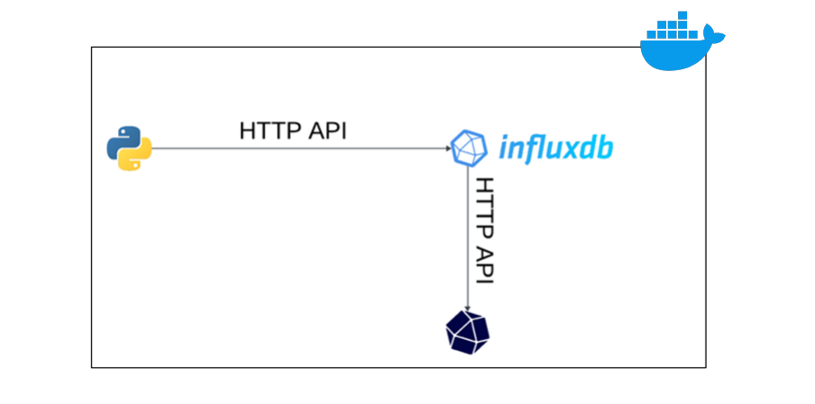

# Environmental-Monitoring-System-using-influxDB
This project simulates an IoT-based environmental sensing system that monitors temperature, humidity, and pressure across multiple locations. The data is stored in an InfluxDB database and can be visualized using InfluxDB's built-in Data Explorer or any other data visualization tool that can connect to InfluxDB.

## Simplified architecture 

## Project Structure

- `docker-compose.yml`: This file contains the Docker Compose configuration for the `influxdb` and `iot` services.
- `Dockerfile`: This file is used to build the `iot` service. It sets up a Python environment and copies the `requirements.txt` and `script.py` files into the Docker container.
- `env_file`: This file contains environment variables used by the Python script, including the organization name, InfluxDB URL, token, and bucket name.
- `script.py`: This Python script simulates sensors by generating random measurements for temperature, humidity, and pressure for different locations and writes them to the InfluxDB database.

## How to Run

1. Make sure Docker is installed on your machine.
2. Clone this repository and navigate to the project directory.
3. Run `docker-compose up` to start the `influxdb` and `iot` services.
4. The Python script will start generating sensor data and writing it to the InfluxDB database.
5. You can visualize the data using InfluxDB's Data Explorer.

## Note

Please replace the values in the `env_file` with your actual InfluxDB organization, URL, token, and bucket name before running the project.